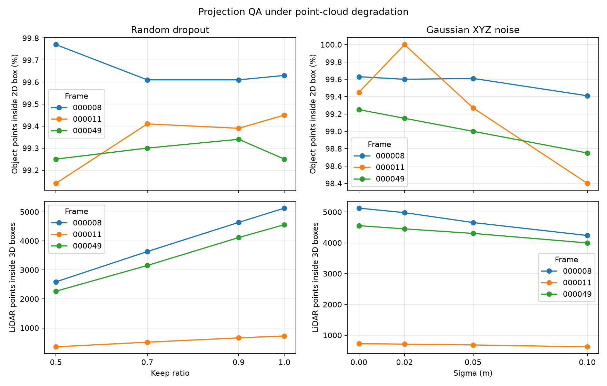
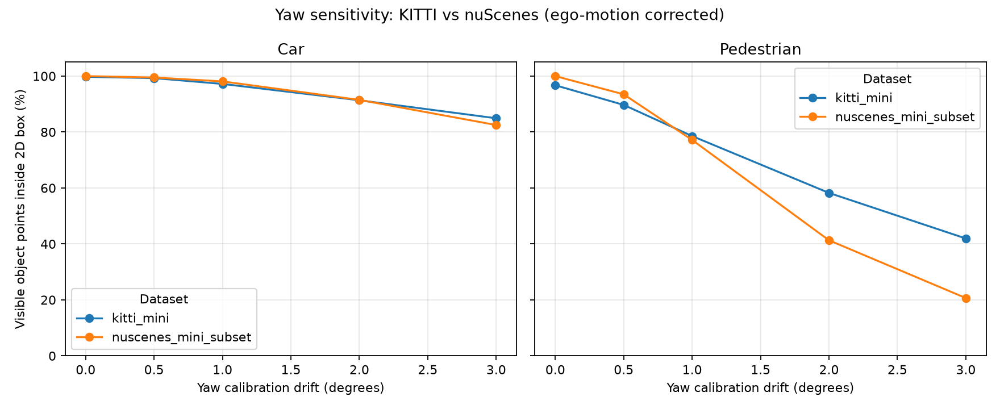

# Báo cáo Day 6 Lab: Độ nhạy phép chiếu LiDAR-camera với lệch yaw

> Kết quả dưới đây lấy từ CSV và ảnh đã sinh trong repo. Topic A; bonus được chọn: B2, B3, B4 và B5.

- **Họ tên:** Vũ Hải Minh
- **MSSV:** 2A202602452
- **Lớp:** AI20K-T4
- **Link repo:** https://github.com/dtc-z/VuHaiMinh-2A202602452-Track4-Day21
- **Topic:** A — Kiểm tra calibration LiDAR-camera
- **Dataset:** `data/kitti_mini` (thử phép chiếu số với `data/synthetic`)
- **Các frame đã dùng:** 000004, 000008, 000011, 000019, 000049

## 1. Claim

Trên KITTI, lệch yaw 1° làm `visible_hit_ratio` giảm hơn 20 điểm phần trăm ở frame nhiều pedestrian 000011, trong khi mức giảm ở frame đông xe 000008 dưới 5 điểm. Số đo lần lượt là 99.45% → 77.44% và 99.63% → 98.75%; claim được dữ liệu xác nhận. `visible_hit_ratio` tính trên các điểm vật thể vẫn chiếu được vào ảnh; CSV cũng ghi tỷ lệ điểm còn trong ảnh.

## 2. Evidence

Kết quả trong `results/yaw_perturb_sweep.csv` (bảng dùng `visible_hit_ratio`: tỷ lệ điểm thuộc 3D box còn chiếu trong ảnh và rơi trong 2D box). CSV cũng có `hit_ratio`, dùng số điểm chiếu được với calibration gốc làm mẫu số nên điểm bị đẩy ra ngoài ảnh được tính là miss; hai biểu đồ yaw vẽ metric này.

| Frame | yaw 0° | yaw 1° | yaw 2° |
|---|---:|---:|---:|
| 000008, đông xe | 99.63% | 98.75% | 94.88% |
| 000011, nhiều người đi bộ | 99.45% | 77.44% | 45.44% |
| 000049, nhiều vật bị che | 99.25% | 93.54% | 84.73% |

Ở frame 000011, yaw 1° làm tỷ lệ giảm 22.01 điểm phần trăm; frame 000008 giảm 0.88 điểm. Số điểm đầu vào lần lượt là 122,555 (000008), 108,004 (000011) và 113,691 (000049). `yaw_sweep.png` cho xu hướng theo frame, còn `yaw_breakdown.png` tách theo class và khoảng cách.


### Bonus [B2] — Suy giảm point cloud

`src.exp_degradation` thử random dropout ở keep ratio 1.0/0.9/0.7/0.5 và Gaussian XYZ noise ở σ=0/0.02/0.05/0.1 m với seed cố định.

| Frame 000011 | Điểm trong 3D box | `hit_ratio` |
|---|---:|---:|
| Dropout keep 1.0 → 0.5 | 725 → 350 | 99.45% → 99.14% |
| Noise σ=0 → 0.1 m | 725 → 624 | 99.45% → 98.40% |

Dropout giảm gần một nửa số điểm nhưng tỷ lệ căn chỉnh gần như giữ nguyên; vì vậy cần theo dõi cả mật độ điểm, không chỉ hit ratio. Ở frame 000008, dropout 50% đưa số điểm trong box từ 5,127 xuống 2,588 trong khi hit ratio đổi từ 99.63% lên 99.77%. Bảng đầy đủ nằm trong `results/degradation_sweep.csv`.



### Bonus [B3] — Latency

`src.bench_projection_latency` đo cùng pipeline QA trên ba frame; mỗi frame bỏ lượt warm-up, đo 20 lượt và lưu từng lần vào CSV.

| Frame | p50 | p95 |
|---|---:|---:|
| 000008 | 47.74 ms | 52.07 ms |
| 000011 | 42.01 ms | 44.62 ms |
| 000049 | 86.55 ms | 94.39 ms |

Máy đo: Intel Core i5-12500H, 16 logical CPU, RAM 15.7 GiB, NVIDIA GeForce RTX 3050 Laptop GPU và Intel Iris Xe; pipeline đo bằng CPU, không dùng GPU. Từng lượt nằm trong `results/projection_latency.csv`.

### Bonus [B5] — KITTI và nuScenes

`src.exp_yaw_dataset_compare` chạy cùng yaw sweep cho Car/Pedestrian ở ba frame mỗi dataset; nuScenes giữ bật bù ego-motion. Tỷ lệ dưới đây được gộp theo số điểm nhìn thấy trong ba frame đã chọn.

| Dataset / class | Điểm vật thể nhìn thấy ở yaw 0° | yaw 0° | yaw 1° | yaw 2° |
|---|---:|---:|---:|---:|
| KITTI — Car | 9,001 | 99.76% | 97.21% | 91.36% |
| KITTI — Pedestrian | 1,068 | 96.72% | 78.56% | 58.24% |
| nuScenes — Car | 610 | 100.00% | 98.11% | 91.50% |
| nuScenes — Pedestrian | 92 | 100.00% | 77.17% | 41.30% |

Ở yaw 2°, pedestrian nuScenes còn 41.30% so với 58.24% ở KITTI. Các frame chứa 34,688–34,752 điểm ở nuScenes, so với 108,004–122,555 ở KITTI; tổng điểm trong pedestrian box tương ứng 92 và 1,068. Tiêu cự khoảng 1,253 px so với 721 px khiến yaw 1° dịch ảnh khoảng 21.9 px so với 12.6 px. Theo chiều rộng ảnh, độ dịch tương ứng khoảng 1.37% (1600 px) và 1.01% (1242 px), nên ảnh rộng hơn không bù hết chênh lệch tiêu cự. KITTI có 64 beam, nuScenes 32; nuScenes còn có khoảng 35 ms lệch timestamp LiDAR-camera và đã bật bù ego-motion. Vì frame, cảnh và mật độ điểm cũng khác nhau, đây là so sánh xu hướng chứ không cô lập nguyên nhân; bảng nằm trong `results/yaw_dataset_compare.csv`.



## 3. Failure case

Frame 000011, yaw extrinsic bị perturb 2°: ảnh `fail_01_yaw2_frame000011.png` cho thấy pedestrian được khoanh mất toàn bộ điểm trong 2D box (tỷ lệ của vật thể là 0.0%); `visible_hit_ratio` gộp các vật thể trong CSV giảm từ 99.45% ở 0° xuống 45.44% ở 2°.

Lớp debug: **Geometry** — extrinsic LiDAR-camera bị lệch yaw. Điểm của vật thể hẹp dịch khỏi label 2D dù frame và point cloud không đổi. Khi chạy thật, theo dõi tỷ lệ điểm pedestrian trong box ở các frame có đủ điểm; cảnh báo ban đầu nếu dưới 90% liên tục 5 phút khi xe dừng.


## 4. Khuyến nghị nếu triển khai thật

Với xe giao hàng tự hành trong đô thị, tính chỉ số riêng cho pedestrian và car khi xe dừng hoặc ở tốc độ thấp. Pipeline tốn p50 42–87 ms/frame và p95 45–94 ms/frame trên CPU máy thử, nên chạy theo sự kiện thay vì mọi frame tốc độ cao. Cảnh báo ban đầu nếu pedestrian `visible_hit_ratio` dưới 90% liên tục 5 phút; hiệu chỉnh theo che khuất và ngày/đêm. Ghi log class, khoảng cách, yaw ước lượng và nhiệt độ giá đỡ cảm biến.

## 5. Cách chạy lại

Chạy từ gốc repo sau khi kích hoạt môi trường đã cài ở CP0:

```powershell
python -m src.test_projection
python -m starter.projection --data-root data/kitti_mini --frame 000019
python -m starter.projection --data-root data/kitti_mini --frame 000011
python -m starter.projection --data-root data/kitti_mini --frame 000004
python -m src.exp_yaw_sweep --data-root data/kitti_mini --frames 000008 000011 000049
python -m src.plot_yaw_sweep
python -m src.exp_yaw_sweep --data-root data/kitti_mini --frames 000008 000011 000049 --out results/check_rerun.csv
python -c "import filecmp; print('GIỐNG HỆT' if filecmp.cmp('results/yaw_perturb_sweep.csv', 'results/check_rerun.csv', shallow=False) else 'KHÁC NHAU')"
Remove-Item -LiteralPath results/check_rerun.csv
python -m src.failure_yaw_demo --data-root data/kitti_mini --frame 000011 --yaw-deg 2 --out results/figures/fail_01_yaw2_frame000011.png
python -m src.exp_degradation --data-root data/kitti_mini --frames 000008 000011 000049
python -m src.bench_projection_latency --data-root data/kitti_mini --frames 000008 000011 000049 --repeats 20
python -m src.exp_yaw_dataset_compare --kitti-frames 000008 000011 000049 --nuscenes-frames scene-0103_010 scene-0103_020 scene-1094_010
python -m src.exp_yaw_sweep --help
python -m src.exp_yaw_sweep
python tools/check_submission.py
```

Thông tin máy dùng cho B3 (Windows PowerShell):

```powershell
(Get-CimInstance Win32_Processor).Name
[math]::Round((Get-CimInstance Win32_ComputerSystem).TotalPhysicalMemory / 1GB, 1)
Get-CimInstance Win32_VideoController | Select-Object -ExpandProperty Name
```

### Bonus [B4] — CLI có thể dùng lại

`src.exp_yaw_sweep` có `argparse`, `help` cho các tham số và mặc định cho dataset, frame, góc yaw và CSV đầu ra. Mục 5 có lệnh `--help` và lệnh không tham số để tái tạo sweep mặc định.

## 6. Khai báo sử dụng AI

| Công cụ | Dùng cho việc gì | Cách kiểm chứng |
|---|---|---|
| ChatGPT | Cài đặt phép chiếu CP2, viết sweep/plot CP3, script failure CP4, script bonus B2–B5 và biên tập report | Các số được đối chiếu với CSV đã sinh; p50/p95 tính sau khi bỏ warm-up. Xu hướng được đối chiếu với biểu đồ, ảnh overlay và ảnh failure. Lệnh self-check CP2 và kiểm tra hình thức nằm trong mục 5. |
