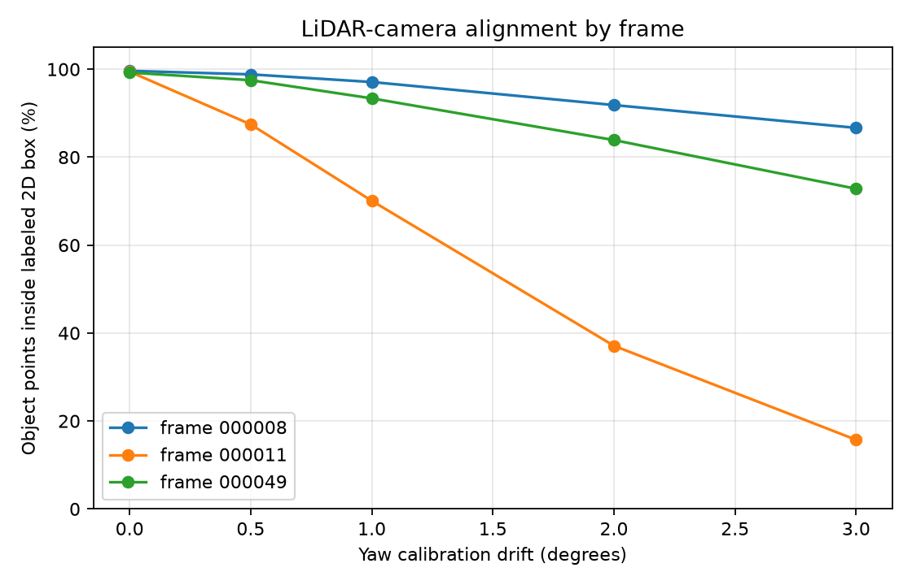
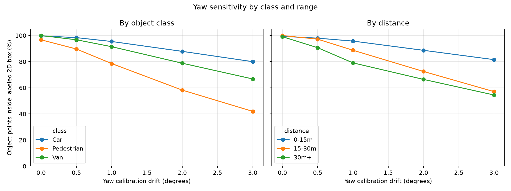
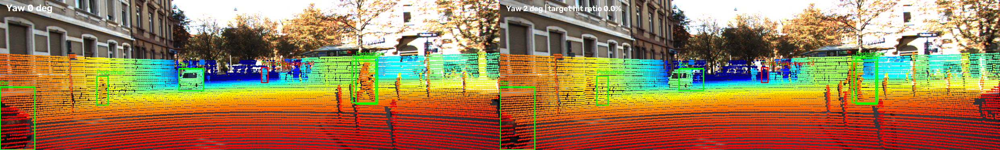

# Báo cáo Day 6 Lab: Độ nhạy phép chiếu LiDAR-camera với lệch yaw

> Bản chuẩn bị trước khi chạy checkpoint. Các số trong bảng Evidence là mốc tham chiếu ghi trong GUIDE, chưa phải kết quả chạy của repo này; sau CP2–CP4 hãy thay bằng số CSV và ảnh vừa tạo.

- **Họ tên:** Vũ Hải Minh
- **MSSV:** 2A202602452
- **Lớp:** AI20K-T4
- **Link repo:** https://github.com/dtc-z/VuHaiMinh-2A202602452-Track4-Day21
- **Topic:** A — Kiểm tra calibration LiDAR-camera
- **Dataset:** `data/kitti_mini` (thử phép chiếu số với `data/synthetic`)
- **Các frame đã dùng:** 000004, 000008, 000011, 000019, 000049

> Hãy viết ngắn: mỗi mục từ 3 đến 8 dòng, ưu tiên số liệu và hình ảnh.

## 1. Claim

Giả thuyết: trên KITTI, lệch yaw 1° làm `visible_hit_ratio` giảm hơn 20 điểm phần trăm ở frame 000011, trong khi mức giảm ở frame đông xe 000008 dưới 5 điểm phần trăm. `visible_hit_ratio` là tỷ lệ điểm thuộc 3D box, còn chiếu được vào ảnh sau perturb, nằm trong 2D box; `visibility_ratio` bổ sung tỷ lệ điểm còn trong ảnh.

## 2. Evidence

Mốc tham chiếu trong GUIDE để đối chiếu với `results/yaw_perturb_sweep.csv` (metric `visible_hit_ratio`):

| Frame | yaw 0° | yaw 1° | yaw 2° |
|---|---:|---:|---:|
| 000008, đông xe | 99.63% | 98.62% | 94.81% |
| 000011, nhiều người đi bộ | 99.45% | 77.44% | 45.44% |

Sau khi chạy CP3, thay bảng mốc này bằng số đọc từ CSV; `yaw_sweep.png` cho xu hướng theo frame, còn `yaw_breakdown.png` tách theo class và khoảng cách.





## 3. Failure case

Frame 000011, yaw extrinsic bị perturb 2°: dự kiến các điểm LiDAR của pedestrian trượt khỏi 2D box hẹp; GUIDE nêu `visible_hit_ratio` toàn frame giảm từ 99.45% ở 0° xuống 45.44% ở 2°. Script CP4 sẽ khoanh pedestrian bị ảnh hưởng nặng nhất và in ID cùng tỷ lệ đo được.

Lớp debug: **Geometry** — extrinsic LiDAR-camera bị lệch yaw. Ảnh hai khung và ID/tỷ lệ thực tế chỉ được chốt sau khi chạy `src.failure_yaw_demo.py`; không coi số tham chiếu GUIDE là kết quả đo của lần chạy này.



## 4. Khuyến nghị nếu triển khai thật

Với xe giao hàng tự hành trong đô thị, tính chỉ số căn chỉnh riêng cho pedestrian và car khi xe dừng hoặc ở tốc độ thấp để không tăng tải xử lý mỗi frame. Dùng 90% làm ngưỡng cảnh báo ban đầu nếu `visible_hit_ratio` pedestrian thấp liên tục 5 phút; hiệu chỉnh ngưỡng bằng dữ liệu ngày/đêm và tình huống che khuất trước khi đưa vào vận hành. Ghi log thêm yaw ước lượng, thời gian, class, khoảng cách và nhiệt độ/ngày bảo dưỡng giá đỡ cảm biến để khoanh vùng nguyên nhân.

## 5. Cách chạy lại

Chạy từ gốc repo sau khi kích hoạt môi trường đã cài ở CP0:

```bash
python -m src.test_projection
python -m starter.projection --data-root data/kitti_mini --frame 000019
python -m starter.projection --data-root data/kitti_mini --frame 000011
python -m starter.projection --data-root data/kitti_mini --frame 000004
python -m src.exp_yaw_sweep --data-root data/kitti_mini --frames 000008 000011 000049
python -m src.plot_yaw_sweep
python -m src.exp_yaw_sweep --data-root data/kitti_mini --frames 000008 000011 000049 --out results/check_rerun.csv
python -c "import filecmp; print('GIỐNG HỆT' if filecmp.cmp('results/yaw_perturb_sweep.csv', 'results/check_rerun.csv', shallow=False) else 'KHÁC NHAU')"
python -m src.failure_yaw_demo --data-root data/kitti_mini --frame 000011 --yaw-deg 2 --out results/figures/fail_01_yaw2_frame000011.png
python tools/check_submission.py
```

## 6. Khai báo sử dụng AI

| Công cụ | Dùng cho việc gì | Cách kiểm chứng |
|---|---|---|
| ChatGPT | Cài đặt phép chiếu CP2, viết sweep/plot CP3, tạo script ảnh failure CP4 và biên tập bản nháp report | Chưa chạy trong lượt chuẩn bị này. Trước khi nộp, chạy `python -m src.test_projection`, so sánh hai CSV sweep, đối chiếu các số với ảnh và tự xem từng khung failure. |
